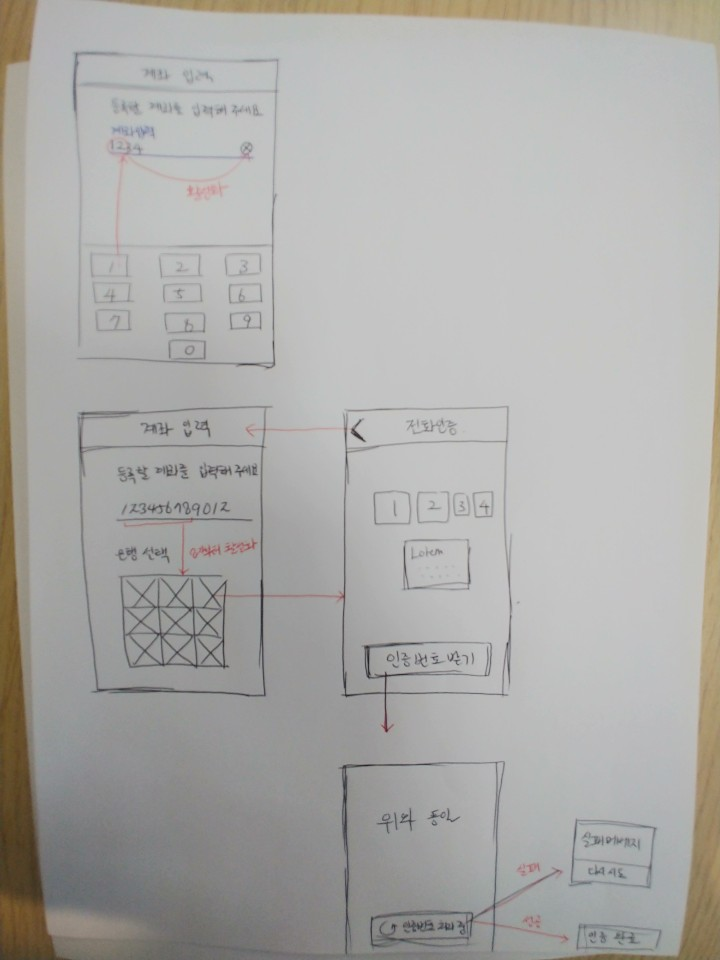

# 계좌 등록 서비스 구현하기

---

## 개발 전 숙지해야 할 사항들

1. `@testing-library/react 과` `@testing-library/jest-dom` 이용하여 테스트 코드를 작성합니다.
   - 참고 할 블로그 [React TDD](@testing-library/react @testing-library/jest-dom)

2) 재사용이 가능하고 확장할 수 있는 컴포넌트를 작성하는데 집중해 주세요.
3) 화려하고 센스있는 애니메이션은 환영합니다.
4) UI 배치는 원하시는대로 하시면 됩니다. 기능을 중점적으로 보겠습니다.
5) 실무에서 사용해보셨던 기술들을 마음껏 녹여주세요.
6) 웹 접근성 및 시멘틱하게 코드를 작성해주세요.
7) 아래에 있는 라이브러리 이외에는 사용을 금합니다.
   - `react-router-dom`
   - `axios`

## 시나리오

> 

## 요구사항

크게 3단계로 서비스가 진행됩니다.

**계좌 번호 입력 페이지** &rarr; **전화 인증 페이지** &rarr; **등록 완료 페이지**

1. 계좌 번호 입력 페이지

   - 상단 네비게이션에는 **계좌 번호 입력** 이라는 타이틀이 있습니다.

   - 첫 화면 진입 시 계좌 번호를 입력 할 수 있는 `input` 박스가 있으며, 자동으로 `focus` 됩니다.

   - `focus` 가 되면 하단에서 숫자 입력용 키보드가 나타납니다.

   - 입력한 계좌번호가 2자리 이상이라면 우측에 `X` 버튼이 활성화 되고, `X` 버튼 클릭 시 입력된 값이 지워집니다.

   - 최대로 입력 할 수 있는 숫자는 12자리이며, 숫자 이외의 값은 입력할 수 없습니다.

   - 입력한 번호가 9자리 이상이라면, 아래 API 를 호출해 추천 은행 목록을 가져옵니다.

     ```bash
     GET - https://fe-account-api.herokuapp.com/api/v1/account?no=102947384726
     ```

     ```js
       {
         success: true,
         banks: [{
           logo: "https://i.picsum.photos/id/12/100/100.jpg",
           name: "신한은행",
           code: "S01",
         },
         ...
        ]
       },
     ```

   - 위 API 를 이용해 `input` 아래에 은행 리스트를 출력 해줍니다.

   - 은행을 선택하면 **전화 인증** 페이지로 이동합니다.

2) 전화 인증 페이지

   - 네비게이션에는 **전화 인증** 이라는 타이틀이 있습니다.

   - 좌측 `<` 버튼 클릭 시 은행 선택 화면으로 돌아가고, 추천 은행 목록 API를 다시 호출합니다.

   - 인증 페이지 진입 시 아래 API 를 호출하여 인증 번호를 중앙에 보여줍니다.

     ```bash
     POST - https://fe-account-api.herokuapp.com/api/v1/account
     ```

     ```js
     // JSON 형식으로 body 에 넣어서 보내야 할 데이터
     {
        name: "신한은행",
        code: "S01",
        account: "102938472838",
     }
     // 응답데이터
     {
       success: true,
       verification: 1394,
     }
     ```

   - verification 코드를 받았다면, 아래 API 로 인증코드를 전송합니다.
     ```bash
     GET - https://fe-account-api.herokuapp.com/api/v1/verification?code=3485
     ```
   - 인증 요청을 하는 동안 버튼에 로딩 UI 를 적용하고, 클릭을 할 수 없도록 합니다.
   - 인증 결과가 `success: false` 로 왔을 경우에는 다시 인증하라는 팝업을 띄어주고, 확인 버튼 클릭 시 같은 데이터로 다시 한 번 요청을 보냅니다.
   - 인증 요청이 실패 했을 경우 3번까지만 **retry** 를 하고 3번까지 실패 했다면, 서비스에 문제가 생겼다는 알림과 함께 첫 페이지로 redirect 시킵니다.

3) 인증 완료

   - 인증이 완료 된 경우 버튼의 텍스트를 `인증 완료` 로 변경 합니다.
   - `인증완료` 버튼 클릭 시 _인증이 완료 되었습니다`_ 라는 메세지와 함께 첫 페이지로 이동합니다.
